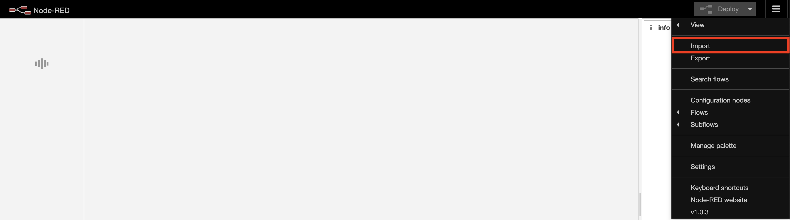
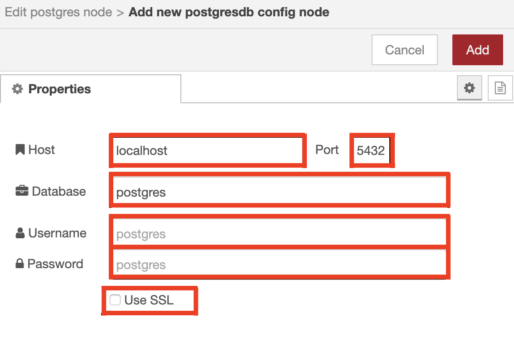

# WORK IN PROGRESS
# Add support for Desk Sensors to IBM Tririga Building Insights

In this code pattern, we will see a methodology to add support for desk sensors to `IBM TRIRIGA® Building Insights (TBI)`. 

TBI relies on IoT and AI to connect and securely store data. It uses this data to learn, analyze and visualize a building’s behavior. It is a cloud-based offering that connects building systems, sensors and external products through a responsive web application. With a single click, you can get AI-based insights, such as future occupancy predictions, across your entire enterprise.

Currently, sensors of any type are not supported out of the box by `TBI`. We will demonstrate a methodology to specifically add desk sensor support to `TBI`. This methodology can be extended to support other types of sensors that are currently not supported out-of-the-box in `TBI`.

When the reader has completed this Code Pattern, they will understand how to:
- Add support for a sensor type to `TBI`
- Visualize occupancy insights on `TBI` based on the data from the sensor
    
## Flow


1. Desk sensors send data to Watson IoT Platform
2. The data is transformed and aggregated before being sent to TBI
3. TBI generates occupancy insights

## Overview of the methodology and steps for supporting sensors 

The reference implementation supports a desk level sensor with the following schema:

```
{
    "timestamp": "12-02-2020 12:52:44",
    "bat": 5,
    "event": 0
}

where,

bat represents the battery level of the sensor
event represents:
0 = Keep Alive
1 = Vacant
2 = Busy
3 = First Transmission
```
TBI expects the occupancy information for an organization and not individual desk. The details of data schema is as follows,

```
{
    "time": "12-02-2020T12:52:44.000Z",
    "occupancycount": 50,
    "orgoccupancycount": 30,
    "orgid": "145786",
    "deviceid": "854609"
}
```

where,

| Property          | Type              | Created out of the Box | Comments|
|-------------------|-------------------|------------------------|---------|
| time              | string(date-time) | No                     |  Time at which the occupancy is derived.   Time must be in UTC and in ISO8601 format yyyy-dd-mm'T'hh:mm:ss.sssZ.|
| occupancycount    | number            | No                     |  The derived occupancy count for the given floor   at the specified time.|
| orgoccupancycount | number            | No                     |  The derived occupancy count of an organization(BU) for a specific floor.|
| orgid             | string            | No                     |  The system record id of the organization in TRIRIGA for which the occupancy is calculated.|
| deviceid          | string            | Yes                    |  The system record id of the floor in TRIRIGA for which the occupancy is calculated. This is the deviceid against which the event needs be sent so that it gets added in the appropriate table. |


## Pre-requisites 

* [**TRIRIGA**](https://www.ibm.com/us-en/marketplace/ibm-tririga)
* [**TRIRIGA Building Insights**](https://www.ibm.com/us-en/marketplace/iot-building-insights)
> Note: TRIRIGA and Building Insights will need to be obtained via the IBM Marketplace, not the IBM Cloud Platform. The link to each service on IBM Marketplace can be found below

## Steps 
1. [Create and configure TBI](#1-create-and-configure-TBI)
2. [Set up and configure sensor on IoT Platform](#2-set-up-and-configure-sensor-on-iot-platform)
3. [Set up and configure IoT sensor support component](#3-set-up-and-configure-iot-sensor-support-component)
4. [Analyze results](#4-analyze-results)

### 1. Create and configure TBI

Create the following services:
* [**TRIRIGA**](https://www.ibm.com/us-en/marketplace/ibm-tririga)
* [**TRIRIGA Building Insights**](https://www.ibm.com/us-en/marketplace/iot-building-insights)

### 2. Set up and configure sensor on IoT Platform

#### Define sensor devices in WIoTP
In order to connect sensor devices to Watson IoT Platform(WIoTP), first it needs to be registered in WIoTP. [This tutorial](https://cloud.ibm.com/docs/services/IoT?topic=iot-platform-getting-started#step1) provides details about how one can register the device type and devices in WIoTP.
While registering each of the desk level sensor to Watson IoT Platform, the following information needs to be provided as metadata for each of the sensors

* **tririgaFloorId:** This id is the system record id of the floor in TRIRIGA under which the desklevel sensors are deployed
* **tririgaOrgId:** This id is thesystem record id of chargeback organization in TRIRIGA to which the seat is allocated

Following are the steps to add the same in metadata of the devices,
* Click **Edit Metadata** button while registering the deive

* Add **tririgaFloorId** and **tririgaOrgId** obtained from TRIRIGA as shown below


#### Create physical & logical interfaces for sensor devices in WIoTP
The reference implementation of sensor support component expects the sensor data in PostgreSQL and in the following format. 
```
event - Number 
timestamp - data-time in ISO-8601 format
tririgaorgid - String
tririgafloorid - String
```

Example,
```
event - 1 
timestamp - "2020-02-27T17:27:21.000"
tririgaorgid - "546876"
tririgafloorid - "925410"
```
to persist the sensor data in PostgreSQL, physical & logical interface needs to be created in WIoTP. Following are the steps to create the same,

* Make sure that the sensor devices are sending the data so that the creation of interfaces are easy
* Click **Create Physical Interface** from device type page,

* Derive properties from running devices as shown below, (**Note** that the schema may be different based on the sensor)

* Click **Create Logical Interface** as shown below,

* Map the sensor data properties as shown below,

* Add the metadata properties as shown below,

* Also, if required transform the timestamp to ISO-8601 format if the original timestamp is not in ISO-8601 format, For example, use the following transformation logic,
```
$join([ $substring($event.timestamp, 6, 4), '-', $substring($event.timestamp, 3, 2), '-', $substring($event.timestamp, 0, 2), 'T', $substring($event.timestamp, 11, 2), ":", $substring($event.timestamp, 14, 2), ":", $substring($event.timestamp, 17, 2), "+03:00"])
```
* Click activate to activate the interface. WIoTP will create a table with name iot_deviceType (Example, iot_SS10) in PostgreSQL and move the raw sensor data.


#### Verify raw sensor data in PostgreSQL
* Connect to PostgreSQL and verify that table with name "iot_deviceType" exists
* Verify that it receives the latest data in the schema set by logical interface. For example,


### 3. Set up and configure IoT sensor support component

#### Deploy Node-RED on IBM Cloud

Refer to [IBM Developer tutorial](https://developer.ibm.com/tutorials/how-to-create-a-node-red-starter-application/) for how to create a new Node-RED Starter Application in IBM Cloud.

#### Add extra nodes to your Node-RED palette
- On your application’s details page, click **View toolchain**.
- In the Continuous Delivery box, click **git**. This step takes you to a git repository where you can edit the application source code from your browser.

- Scroll down the list of files and click on **package.json**. This file lists the module dependencies of your application.

- Click the **Edit** button.

- Add the following entries to the top of the dependencies section (1):
```
"node-red-dashboard": "2.19.4",
"node-red-contrib-scx-ibmiotapp": "0.0.49",
"node-red-contrib-postgres-multi": "0.2.0",
"node-red-contrib-loop-processing": "0.3.1",
"node-red-contrib-ibm-wiotp-device-ops": "0.1.3"
```

> Note: Do not forget the comma (,) at the end of the line to separate it from the next entry.
- Add a Commit message (2) and click Commit changes (3)

- At this point, the Continuous Delivery pipeline will automatically run to build and deploy that change into your application. If you view the Delivery Pipeline you can watch its progress. The Build section shows you the last commit made (1) and the Deploy section shows the progress of redeploying the application (2).

- After the Deploy stage completes, your application will have restarted and now have the node-red-dashboard nodes preinstalled.

#### Import Flows

After the Node-RED is installed, import the Desk level sensor support flows. Complete the following steps. 
1. Go to he Node-RED user-interface,  in the top right corner click on 3 horizontal dashes. A drop-down menu displays.
 

2. Click on **Import** and then **clipboard**. A pop up window displays.

 
3. Copy the [desk_sensor_support_flow.json](./desk_sensor_support_flow.json) to this window  and click on **import**.

#### Configure Nodes 
You need to configure the following nodes in the Flows

##### Configuration & validation Flow 
1. In Configure TBI credentials function node

  

 you need to change the following credentials  
```
credentials = {
    "username":"abc@in.ibm.com", // TBI Username
    "password":"*******************", // TBI Password
    "url":"https://TBI-AGG.mybluemix.net", // TBI URL
    "deviceType":"PIR",   // Sensor device type from WIoTP
    "aggregationInterval":15,  // Aggregation Interval in minutes
    "stopOnValidationfailure": true,
    "offset": "-05:00" // Building Offset
}
```
2. In Get devices from WIoTP Node you need to add your WIoTP credentials,

 

3. In that node you will find API key click on the small pen button to add your credentials

 

4. Now add your API Key and API token in the given Fields
 

5. Then click on update or add and then done.

#### Realtime aggregation FLow ####

1. In Publish to WIoTP node you need to add your WIoTP credentials


2. In that node you will find API key click on the small pen button to add your credentials


3. Then you need to add your WIoTP credentials in the given **API key** and **API Token** Fields and add **Application ID** as any name


4. Then click on update or add and then click on done to add your WIoTP credentials to sensor_support.

#### Historical data aggregation ####

1. In the Read dataa node you need to configure with PostgreSQL credentials


2. In this node click on the edit button to add your postgreSQL credentials


3. Now you need to add the following credentials to this node
```
  1. Host
  2. Port
  3. Database
  4. Username
  5. Password
  6. Add mark Use SSL
```


4. Click on update or add and then Done

#### Validation flow

Validation flow verifies whether all the sensor devices are configured with the required meta data and are present in TBI as well, 


Once validation is successful, it automatically triggers the realtime flow and it works in the following way,
* Validates if all the credentials are configured
* Logs into TBI using the provided credentials
* Retrieves all the floors and orgIds that are synched from TRIRIGA to TBI
* Retrieves the meta data of all the sensor devices from WIoTP
* Validates the following,
    * Whether all the devices contain tririgafloorid and tririgaorgid in the metadata
    * Whether the tririgafloorid in the metadata matches the floorid in TBI
```
sensors = msg.payload.results
error_sensors = {}
msg.payload.success = true
tbiFloors = msg.floors
for(i=0;i<sensors.length;i++){
    tririgaFloor = ""
    tririgaOrg = ""
    tririgaFloor = sensors[i].metadata.tririgaFloorId
    tririgaOrg = sensors[i].metadata.tririgaOrgId
    if(tririgaFloor === "" || tririgaOrg === ""){
        error_sensors[sensors[i]['deviceId']] = "Floor Id or Org Id not there in metadata"
    }
    if(!(tbiFloors.includes(tririgaFloor))){
        error_sensors[sensors[i]['deviceId']] = "Floor Id not in TBI floors"
    }
}
```
* If all validation is successful, triggers the realtime aggregation flow
* Validation errors are seen in the debug window or the content window. To view the validation errors in conext window, follow the steps shown in below diagram,


**Note:** Incase if one wants to execute realtime aggregation flow even with the validation failures, then set **stopOnValidationFailure** flag to false in **Configure TBI Credentials** node as shown below,


#### Realtime data aggregation

Realtime aggregation flow starts whenever the TBI credentials are set and there are no validation failures. It works in the following way,


* Forms a PostgreSQL query to get the latest events of all the sensor devices in the last 24 hours from the raw sensor table 

```
SELECT * FROM (SELECT event, deviceid, tririgaorgid, tririgafloorid, timestamp, row_number() OVER (PARTITION BY deviceid ORDER BY timestamp DESC) AS rn  FROM iot_deviceType where tririgafloorid IS NOT NULL and tririgaorgid IS NOT NULL and (event = 1 or event = 2) and timestamp >= (NOW() - '1 day'::interval)) t2 WHERE rn = 1
```
* Query filters only those sensors for which occupancy data (either 1 or 2) is present
* Executes the query
* Aggregates occupancy data (vacant or busy) at org level based on metadata "tririgafloorid" and "tririgaorgid"
```
for(i=0;i<payload.length;i++){
    floorId = payload[i]['tririgafloorid']
    orgId = payload[i]['tririgaorgid']
    orgKey = floorId+":"+orgId
    if(!floors.includes(floorId)){
        floors.push(floorId)
        occdata[floorId] = 0
    }
    if(!floorOrgs.includes(orgKey)){
        floorOrgs.push(orgKey)
        occdata[orgKey] = 0
    }
    occupancy = 0
    if(payload[i]["event"] == 2){
        occupancy = 1
    }
    occdata[floorId] = occdata[floorId] + occupancy
    occdata[orgKey] = occdata[orgKey] + occupancy
}
```
* Formats the aggregated data into the form required by Watson IoT Platform(WIoTP) and TBI
* Uses the IBM IoT node to send the aggregated occupancy data into WIoTP platform
* Flow loops for every aggregation interval specified. Incase if one wants a more accurate data, then set the aggregation interval to lower value in configuration flow.
* **Note:** If your sensor data requires different way of aggregation, then modify the **PostgreSQL Query" and **Compute occupany** node in the flow with required aggregation logic.

#### Historical data aggregation

Historical data aggregation aims to work on the historical data if any and provide the occupancy by the aggregation interval specified. The flow needs to be triggered manually and it works in the following way,


* Triggers the flow if its not running already
* Forms a PostgreSQL query to get the least time where the first entry is present,
```
select timestamp from iot_deviceType order by timestamp asc limit 1
```
* Executes the query and retrieves the time from PostgreSQL
* Forms the start time and end time based on the time retrieved and aggregation interval
* Forms another PostgreSQL query to get the data between the start time and end time
```
SELECT * FROM (SELECT event, deviceid, tririgaorgid, tririgafloorid, timestamp, row_number() OVER (PARTITION BY deviceid ORDER BY timestamp DESC) AS rn  FROM (select * from iot_deviceType" where timestamp > start_time and timestamp <= end_time as tmp where event = 1 or event = 2) t2 WHERE rn = 1
```
* Query filters only those sensors for which occupancy data (either 1 or 2) is present
* Executes the query
* Aggregates occupancy data (vacant or busy) at org level based on metadata "tririgafloorid" and "tririgaorgid"

```
    floorOrgs = global.get("hist_floorOrgs")
    sensors_state = global.get("hist_sensors_state")
    occdata = global.get("hist_occdata")
    floors = global.get("hist_floors")
    var occupancy = 0
    for(i=0;i<payload.length;i++){
        prev_state = 1
        if(payload[i]['deviceid'] in sensors_state){
            prev_state = sensors_state[payload[i]['deviceid']]
        }
        curr_state = payload[i]["event"]
        floorId = payload[i]['tririgafloorid']
        orgId = payload[i]['tririgaorgid']
        orgKey = floorId+":"+orgId
        if(!floors.includes(floorId)){
            floors.push(floorId)
            occdata[floorId] = 0
        }
        if(!floorOrgs.includes(orgKey)){
            floorOrgs.push(orgKey)
            occdata[orgKey] = 0
        }
        if(curr_state == 2 && prev_state == 1){
            occupancy = 1
        }
        else if(curr_state == 1 && prev_state == 2){
            occupancy = -1
        }
        else{
            occupancy = 0
        }
        occdata[floorId] = occdata[floorId] + occupancy
        occdata[orgKey] = occdata[orgKey] + occupancy
        sensors_state[payload[i]['deviceid']] = curr_state
    }
```

* Maintains the state of each sensor such that the occupancy count is calculated from the previous state when the data comes in for the next batch
* Forms a next batch request where the start time and end time is adjusted to next cycle based on aggregation interval specified
```
    start_time = new Date(global.get("hist_start_time"))
    end_time = new Date(global.get("hist_start_time"))
    end_time.setMinutes(new Date(end_time).getMinutes() + credentials.aggregationInterval)
```
* The flow also parallely formats the aggregated data into the form required by TBI and uses the IBM IoT node to send the aggregated occupancy data into WIoTP platform
* Flow loops untill the current time is reached.
* **Note:** If your sensor data requires different way of aggregation, then modify the **Form SQL Query" and **Compute occupany** node in the flow with required aggregation logic.

### 3. Analyze Results
TODO

## Related content

[Integrate a TRIRIGA perceptive app with Building Insights APIs](https://developer.ibm.com/patterns/tririga-perceptive-app-w-building-insights/)

[Integrate an Indoor Positioning System with TRIRIGA](https://developer.ibm.com/patterns/indoor-positioning-mobile-app-iot-platform-tririga-building-insights/)
